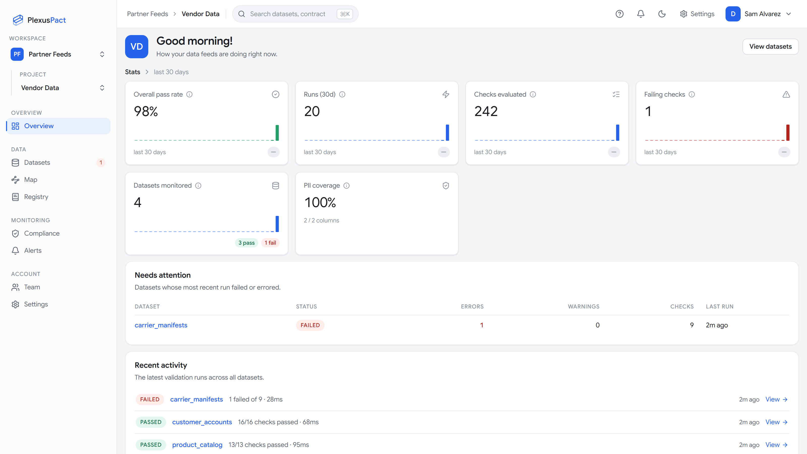

<div align="center">
  <picture>
    <source media="(prefers-color-scheme: dark)" srcset=".github/assets/logo-dark.png">
    
  </picture>

**Validate data at the source — before it burns your warehouse.**

[](https://github.com/info-dataplexor/plexuspact/actions/workflows/ci.yml)
[](https://github.com/info-dataplexor/plexuspact/releases)
[](LICENSE)
[](docs/src/introduction.md)

</div>

Data teams today discover bad data **after** it lands in Snowflake or BigQuery — after it has burned warehouse compute, broken dashboards, and triggered a 2 a.m. incident. PlexusPact moves validation to the **left**: a single compiled Rust binary (powered by Polars/Arrow) that validates data against a versioned `contract.yaml` at the source — in the application's CI pipeline, at the API boundary, or on the file before upload. It is zero-boilerplate where Great Expectations is verbose, compiled-fast where Python is slow, and streaming/out-of-core where Pandas hits OOM.

- **One binary, zero dependencies.** No Python, no JVM, no pip install. Under 40 MB, cold start under 50 ms.
- **One YAML file.** A 10-line contract covers schema, quality rules, ownership, and severity.
- **Streaming by design.** Validates a 10 GB CSV on a 4 GB laptop without breaking a sweat.
- **Built for CI.** Deterministic exit codes, JSON/JUnit output, an official GitHub Action, PR annotations.
- **Errors are product.** Every failure tells you the column, the rule, the observed values, and sample rows.

The same contracts power [**PlexusPact Cloud**](https://github.com/info-dataplexor/plexuspact-cloud) — the hosted control plane with continuous validation, run history, drift charts, and signed pass/fail webhooks for every partner feed:



## Install

**Shell script (Linux/macOS):**

```sh
curl -fsSL https://raw.githubusercontent.com/info-dataplexor/plexuspact/main/install.sh | sh
```

**PowerShell (Windows):**

```powershell
irm https://raw.githubusercontent.com/info-dataplexor/plexuspact/main/install.ps1 | iex
```

**Homebrew** _(landing with the v0.1.0 release)_:

```sh
brew install info-dataplexor/tap/plexuspact
```

**Scoop** _(landing with the v0.1.0 release)_:

```powershell
scoop bucket add plexuspact https://github.com/info-dataplexor/scoop-bucket
scoop install plexuspact
```

**Cargo (build from source):**

```sh
cargo install --git https://github.com/info-dataplexor/plexuspact plexuspact-cli
```

Verify: `plexuspact --version`

## Quick start

Bootstrap a contract from any CSV, Parquet, NDJSON, JSON, Excel, XML or fixed-width file — `init` profiles the data and writes a draft with inferred types and conservative, commented suggestions:

```sh
$ plexuspact init signups.csv --out contract.yaml
Profiled 1,204,441 rows × 6 columns in 4.1s
Wrote contract.yaml (6 columns typed, 3 suggested checks commented out)
```

Edit the contract to say what must be true:

```yaml
apiVersion: v1
dataset: user_signups
owner: growth-team@acme.com
description: Daily signup export from the app database.
consumers:
  - { name: analytics-core, contact: data-team@acme.com, reads: [user_id, plan] }

columns:
  user_id:   { type: string, required: true, checks: [unique] }
  email:     { type: string, required: true, pii: email, checks: [{ format: email }] }
  age:       { type: int,    checks: [{ min: 18 }, { max: 120 }] }
  country:   { type: string, checks: [{ length: 2 }, { regex: "^[A-Z]{2}$" }] }
  plan:      { type: string, checks: [{ enum: [free, pro, enterprise] }] }
  signed_up: { type: datetime, required: true }

dataset_checks:
  - row_count_min: 1
  - freshness: { column: signed_up, max_age: 48h, severity: warn }
  - null_ratio_max: { column: age, ratio: 0.10 }

settings:
  allow_extra_columns: true
  on_type_mismatch: error
```

Then check any dataset against it:

```
$ plexuspact check signups.csv --contract contract.yaml

✗ user_signups — 2 of 14 checks failed (1,204,441 rows in 6.2s)

  ✗ email · format: email          3 rows failed (0.0002%)
      row 10442: "bob@@example"
  ✗ age · min: 18                  512 rows failed (0.04%)
      min observed: 11
  ⚠ signed_up · freshness ≤ 48h    newest row is 51h old   [warn]

$ echo $?
1
```

Exit codes are CI-grade: `0` pass, `1` error-severity failures, `2` usage/contract error, `3` internal error. `warn` failures exit `0` unless you pass `--strict`. Add `--format json` for machine-readable results and `--report out.html` for a self-contained, shareable HTML report.

Full walkthrough: [the 5-minute tutorial](docs/src/quickstart.md).

## The check library (20 core checks)

| Category | Check | What it asserts |
|---|---|---|
| Schema | `type` | Column values parse as the declared type (`string`, `int`, `float`, `bool`, `date`, `datetime`) |
| Schema | `required` | Column exists and contains no nulls |
| Schema | `columns_exact` | The dataset has exactly the declared columns |
| Schema | `allow_extra_columns` | Whether undeclared columns are tolerated (setting) |
| Values | `unique` | No duplicate values (exact by default; `approx: true` for HyperLogLog) |
| Values | `min` | Numeric/temporal values ≥ bound |
| Values | `max` | Numeric/temporal values ≤ bound |
| Values | `regex` | String values match a pattern |
| Values | `enum` | Values come from a fixed set |
| Values | `length` | String length (exact, or `{ min, max }`) |
| Values | `not_empty_string` | No empty strings |
| Values | `format: email` | RFC-style email shape |
| Values | `format: uuid` | UUID shape |
| Values | `format: iso_date` | `YYYY-MM-DD` |
| Values | `format: iso_datetime` | ISO-8601 timestamp |
| Values | `format: url` | Parseable URL |
| Values | `format: country_code_iso2` | ISO-3166 alpha-2 code |
| Dataset | `row_count_min` / `row_count_max` | Total row count bounds |
| Dataset | `freshness` | Newest value in a timestamp column is at most `max_age` old |
| Dataset | `null_ratio_max` / `unique_ratio_min` | Null/distinct ratio bounds per column |
| Dataset | `primary_key` | The row identity: present on every row, never repeated |
| Dataset | `assert` | One SQL statement about the whole dataset (`SUM(amount) = 1000`) |
| Dataset | `references` | Every key exists in another dataset's last passing delivery, or a file |
| Escape hatch | `custom_expr` | Any Polars boolean expression |

Every check takes an optional `severity: error | warn` (default `error`). See the [contract reference](docs/src/contract-reference.md) for YAML examples of each.

## Use it in CI

The official GitHub Action downloads a pinned, checksum-verified binary, runs the check, annotates the PR with each failed check, and uploads the HTML report as an artifact:

```yaml
- uses: info-dataplexor/plexuspact/action@v0.1.0
  with:
    contract: contracts/user_signups.yaml
    data: export/signups.csv
    strict: "true"
```

Recipes for GitLab CI, Airflow, and cron are in [docs/src/ci-recipes.md](docs/src/ci-recipes.md); the repository also ships [pre-commit hooks](.pre-commit-hooks.yaml) that lint staged contracts and refuse breaking changes.

## Commands

```
plexuspact init <path> [--out contract.yaml]        # profile data, draft a contract
plexuspact check <path|-> --contract <file>         # validate (file or stdin)
    [--format human|json|junit] [--report out.html]
    [--strict] [--sample-failures N] [--reference DATASET=PATH]
plexuspact diff <old.yaml> <new.yaml>                # classify contract changes (exit 1 on breaking)
plexuspact validate-contract <file>                  # lint a contract without data
plexuspact push <result.json|->                      # report a saved result to PlexusPact Cloud

# Global: --offline (never open a socket), -v/-vv (logs to stderr)
```

Inputs: CSV/TSV (delimiter/quote/encoding options), Parquet, NDJSON, JSON array (or an array under `--json-path`), Excel and OpenDocument workbooks (`--sheet`, `--skip-rows`), XML (`--xml-record`), fixed-width text (`--fixed-width id=1-8,name=9-40`) — from a file or stdin, with transparent gzip/zstd decompression. The reading instructions can live in the contract under `settings.input`, so a partner's workbook or mainframe extract is checked the same way in CI, on a laptop and in the cloud without anyone remembering the flags.

## Performance

Measured with the repo's Criterion bench (`cargo bench -p plexuspact-engine`) on an ordinary Windows 11 desktop (no tuning): a 5-column string-typed dataset under 9 active checks (uniqueness, regex, format, bounds) validates at **~1.1 M rows/s** — 100k rows in ~91 ms, 1M rows in ~0.9 s — and throughput holds flat as row count grows 10×. Engine time excludes file parsing; end-to-end `check` on a real 1.2M-row CSV lands around 6 s including I/O. Run the bench yourself; numbers on your hardware are the only ones that matter.

## Documentation

- [Introduction](docs/src/introduction.md) · [Installation](docs/src/installation.md) · [5-minute quickstart](docs/src/quickstart.md)
- [Contract reference](docs/src/contract-reference.md) — every field, every check
- [CI recipes](docs/src/ci-recipes.md) · [Exit codes](docs/src/exit-codes.md) · [JSON result schema](docs/src/result-schema.md)
- [Keeping a history](docs/src/cloud.md) — reporting runs to PlexusPact Cloud
- [Telemetry and network policy](docs/src/telemetry.md) · [FAQ](docs/src/faq.md)
- [Architecture decision records](docs/adr/)

Build the book locally with [mdBook](https://rust-lang.github.io/mdBook/): `mdbook serve docs`.

## Roadmap

**Now (Phase 1 / v0.1–v0.3):** the full check library, `init` profiling, HTML reports, `diff`, JSON/JUnit output, GitHub Action, streaming stdin — everything above.

**Next (Phase 1.5 / v0.4):** quarantine mode (`--quarantine bad_rows/` routes failing rows losslessly with per-row reasons — routing, never mutation) and AI-assisted authoring (`init --ai`, `explain --ai`; strictly opt-in, bring your own key or local model, and never in the enforcement path — `check` results are bit-identical with AI disabled).

**Later (Phase 2):** SQL sources via DataFusion, Python/Node bindings, and the hosted registry below. ODCS 3.1 import/export is already in (`plexuspact export --target odcs`, `plexuspact import`), as is dbt (`plexuspact export --target dbt` plus the [dbt test package](integrations/dbt)) and Databricks DLT (`--target databricks-dlt`).

## Open core, honestly

The CLI — every check, every output format, `init`, `diff`, quarantine when it ships — is **Apache-2.0, free forever**. Single-developer productivity is never paywalled.

The commercial product is **PlexusPact Cloud** (separate codebase): contract history, drift charts, alerting, blast-radius lineage, and compliance evidence for teams. The CLI never requires an account — with no `PLEXUSPACT_API_KEY` set it opens no sockets at all, and `--offline` guarantees that whatever else is configured. Set a key and `check` [reports each result](docs/src/cloud.md) to your project on its own; there is no glue to write, and the exit code stays the data's alone. `consumers` is what blast radius reads: name the teams that depend on a dataset and the columns each one `reads`, and the cloud can tell you who breaks before you approve a tightening. The CLI's own verdict is untouched by it — `check` ignores consumers entirely. The `pii` and `classification` fields are still reserved: parsed, validated, and echoed into reports, nothing more, so your committed contracts are ready for compliance reporting later.

## Contributing

Contributions welcome — see [CONTRIBUTING.md](CONTRIBUTING.md) for dev setup, ground rules, and the test strategy. Found a security issue? See [SECURITY.md](SECURITY.md). All notable changes land in the [CHANGELOG](CHANGELOG.md).

## License

Apache License 2.0 — see [LICENSE](LICENSE) and [NOTICE](NOTICE).
